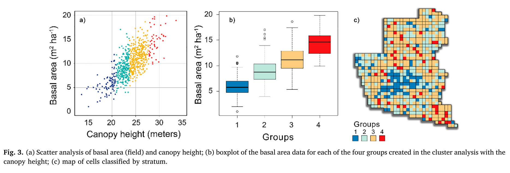

--- 
title: "SGS"
author: "Tristan Goodbody"
date: "`r Sys.Date()`"
site: bookdown::bookdown_site
documentclass: book
bibliography: [sgs.bib, packages.bib]
biblio-style: apalike
link-citations: yes
---
```{r, include=FALSE}
knitr::opts_chunk$set(echo = TRUE)
```

# Overview {-#overview}

This document is a brief introduction to the structurally guided sampling project. Herein i provide a:

* Literature review about [SGS](#SGS)

* Overview of how [data has been prepared](#dataprep)

* Work done in the RMFinventory package using [principle components](#princomp)

* Potential methods to apply using [stratification and sampling methods](strat)

* Points to [discuss](#disc) for how the project should evolve 

<!--chapter:end:index.Rmd-->

# Structurally Guided Sampling Review {-#SGS}

[@McRoberts2012] outline the essence of structurally guided sampling: 

>Stratified estimation is a statistical technique that can be used to increase the precision of estimates without increasing sample sizes. The essence of stratified estimation is to aggregate observations of the response variable into groups or strata that are more homogeneous than the population as a whole. The population mean and its variance are estimated as weighted means ofwithin-strata means and variances where the weights are based on strata sizes. If the stratification is accomplished prior to sampling and the within-stratum variances are known or can be easily estimated, then greater precision may be achieved by selecting within-strata sampling intensities to be proportional to within-strata variances (Cochran, 1977).

Following literature review I present a number of implementations that have been used to guide the stratification of ALS-derived structural variables for locating representative sample plots. 

Studies including [@Leiterer2015] and [@Kane2010] suggest that the information in the ALS data may be condensed to a few metrics. Many of the studies reviewed seem to adopt this by selecting a low number of metrics which they use to stratify the landscape and consequently sample within.[@Fedrigo2018] further outlined:

>_"Lidar metrics may be useful for forest stand classification if they differentiate classes of interest (Wulder et al., 2008). The separation of the data into vertical layers allows metrics to be derived for specific forest strata, which may increase the discrimination of multi-strata stand types. The selection of breaks that define these strata can be based on field knowledge or identified statistically from lidar profiles (Lefsky et al., 1999; Zhang et al., 2011)."_

An additional note of interest is that a great deal of research in the field of digital soil mapping can be applied to structurally guided sampling. Studies including [@Carre2007], [@Ma2020], and [@Malone2019] were invlauable for understanding how to use auxillary variables to determine effective sampling protocols - especially in the context of Lahin Hypercube Sampling.

## Stratification approaches {-#stratapp}

### [@Hawbaker2009] {-}

Used ALS mean and SD to stratify. First they separated forest types then 10 strata were derived suing mean height. Within each stratum, 3 additional sub-strata were created using SD. This produced a total of 30 stratifications where one coniferous forest and two deciduous forest locations randomly selected. They compared samples taken from strata with a random sample finding that:
>Prediction errors from models constructed using a random sample were up to 68% larger than those from the models built with a stratified sample. The stratified sample included a greater range of variability than the random sample.

```{r,echo=FALSE}
knitr::include_graphics("img/Hawbaker2009_Fig1.png")
```

### [@Dalponte2011] {-}

They analyzed 2 aspects of ground reference data collection. 

1. The positioning error of the ground plots
2. The optimal number of training plots. 

They had a large collection of samples >700 and systematically analyzed how the reduction of sample numbers influenced accuracy of attribute estimates.

They tested the effect of error in estimate related to distance the center point of the plot was moved.

>The decrease was at a minimum when the displacement was less than 5 m, while it was considerable over 10 m.

They did random downsampling of the sample plot number and stratified downsampling of the sample plot number. They used the methods from [@Hawbaker2009] and [@Maltamo2011] for stratified downsampling.

> Comparing the results obtained with the proposed stratified sampling method and the other three methods considered (see Table 3), one can see that the proposed stratified sampling method was the one that provided the best results for both sets.

>The new protocol allowed us to obtain promising results for the considered dataset: using only 53 training plots, instead of 534 in the original dataset, we obtained the same results for the validation set.

### [@Maltamo2011] {-}

Used divided P90 into 12 even parts. A near equal number of sample plots were systematically chosen within each of these 12 parts according to the range of VEG (ratio of vegetation points and ground points). To representatively sample the 12 parts and to cover the extremes, selection intensity was higher in the p90 range range with the lowest number of previously established plots. The use of ALS data as a priori information provided the most accurate results.

They also provide the an important statement:

>_"One should keep in mind that in real world applications ,some given ALS variables will have to be used for selection of plots regardless of which and how many biophysical properties  the inventory aims at estimating. Thus, some ALS variables will work better for certain biophysical properties than for others. An appropriate way of choosing suitable ALS variables could be to select them according to the relative importance of the biophysical properties to be estimated.for volume and number of stems. plots. REduced total sample size incrementally."_

### [@Junttila2013] {-}

Used a number of approaches including a _space filling design_, which attempts to sample uniformly across a feature space. The Maximin design attempts to cover a feature space as uniformly as possible given a fixed number of sample points. It maximizes the minimum distance between plots.

>The results indicate that choosing the plots in a way that ensures ample coverage of both spatial and feature space variability improves the performance of the corresponding models, and that adequate coverage of the variability in the feature space is the most important condition that should be met by the set of plots collected.

```{r,echo=FALSE}
knitr::include_graphics("img/Juntilla2013_Fig6.png")
```

### [@Valbuena2013] {-}

Used the Cover metric to privde a idea of the density of each forest area. The justified that cover influenced the relation between other metrics and the forest response and, therefore, it was included in all the models computed.

### [@Grafstrom2013] {-}

Presents the [@R-BalancedSampling] package. and does comparisons between Simple random sampling (SRS) and: 

#### Local pivotal method with x and y coordinates (LPM-xy) {-}
> to make sure the sample is well spread geographically. The Euclidean distance is used without standardization because the spatial coordinates are on the same scale.

#### Local pivotal method (LPM) {-}
> XY and four selected ALS variables as auxiliary variables. The samples are well spread geographically and well spread in the four ALS variables. The distance function (eq. (3)) is used.

#### Cube method (CM) {-}
>The samples are balanced on the four ALS variables. The x and y coordinates are not used for this method, because it does not make sense to balance on geographical coordinates.

#### Local cube method (LCM) {-}
>The samples are balanced on the four ALS variables and the x and y coordinates are used to make sure the sample is well spread geographically. The Euclidean distance is used in the geographical space. 

They found that spreading the sample well in geographical space is important. Spreading the sample well in all auxiliary variables (LPM) and using the HT estimator was in all cases a more efficient strategy than SRS followed by a calibration estimator. 

Spreading the sample well is more efficient than balancing (or SRS followed by calibration) if the relationship between the target and the auxiliary variables is nonlinear, which is why it performs better (see Tables 2 and 3). 

The final order of the designs combined with the calibration estimator was (from best to worst) LCM, LPM, LPM-xy, CM, and SRS. We get the best results when using the information both in the design and the estimator. Hence, we can conclude that using auxiliary information in the design is very important. "

All three designs, LCM, LPM, and CM, had very good design effects. The reduction of the variance of the HT estimator was for the main target variable volume up to 75% compared with SRS.

### [@Grafstrom2014] {-}

Continuation of previous study highlighting value of sampling methods. 

>A possible drawback of the LPM compared with more simple methods such as systematic random sampling is that sample se- lection is computationally intensive for large populations. This is a problem because the population size (number of pixels) tends to be rather large in forest applications with auxiliary data from, e.g., airborne LiDAR, making it practically impossible to apply the LPM as it is. To deal with this problem, we introduce a new rapid suboptimal implementation ofthe LPM that can be applied to large populations.

>With the LPM, there is no stratification or other difficult design choices; we only need to define distance. Modelling is not really necessary, which means no complicated formulas. Yet this is a very competitive strategy in many cases. It has the advantage of being intuitive and simple, which should not be underrated. It also allows us to keep the traditional design-based approach, while still taking advantage of powerful auxiliary information.

>With the LPM, there is no stratification or other difficult design choices; we only need to define distance. Modelling is not really necessary, which means no complicated formulas. Yet this is a very competitive strategy in many cases. It has the advantage of being intuitive and simple, which should not be underrated. It also allows us to keep the traditional design-based approach, while still taking advantage of powerful auxiliary information.

### [@Niemi2016] {-}

Used ALS textural CHM metrics (HIST,PATCH,GLCM,LBP) for pre-stratification of the inventory area. They tested the strength of the relationship between metrics and central attributes of forest growing stock (Vol,BA,Diam). It was found that the dispersion of the clusters derived in an **unsupervised** mode could be used as an indicator for prioritizing the plots to be measured as the sample to form the reference data for the wall-to-wall models.

### [@Valbuena2017] {-}

Used a rule based method to stratify forest areas using Lmoments including Lcv and Lskew.

### [@McRoberts2017] {-}

Modeling inventory attributes with ALS metrics. BA was considered as an _"integrator of all the response variables"_ and was used as the basis for constructing strata using a lonear model. Predictions of BA were then scaled by the largest BA prediction,multiplied by 100, then assigned 1 of 100 potential strata. Strata were then aggregated these into 4,6,8 strata with approximately equal proportion of study area.

>Stratifications that are most effective with respect to minimizing variances are based on variables that are closely related to the response variable or variables of interest. When multiple response variables are to be estimated simultaneously, the same stratification must be used for all response variables to ensure compatibility.

Results showed they were able to:
>Reduce sampling intensity by up to 35% without losing accuracy in the estimators. Relative to the simple random sampling estimators that used no stratification, use of four strata decreased SEs by 29.0%–38.1%, depending on the response variable; relative to four strata, use of six strata reduced SEs by 2.3%–7.3%; and relative to six strata, use of eight strata reduced SEs by no more than 4% and for two response variables actually increased SEs.

>From an operational perspective, the results of the study suggest that multivariate, airborne laser scanning-assisted inventories could be fairly easily implemented, subject to availability of the airborne laser scanning data.

### [@Malone2019] {-}

They provide an indepth description of how to implement and improve the outputs of Latin Hypercube sampling, providing a coded example of how to incorporate already acquired samples accross the landscape. They specify a method to boostrap sample size followed by the application of multiple methods to determine the optimal sample number to use based on auxillary data.

### [@Papa2020] {-}

Compared simple random sampling to stratified sampling within strata groups. Used hierarchical cluster analysis for formation of strata. Clusters were used for sub-sampling. The number of clusters was established by the Elbow method. Clusters were validated with an ANOVA post-hoc Tukey test. 

Varying size of metric cells (1, 0.5, 0.25 ha) were tested. The stratified sampling was simulated by using weighting distributed by strata, so that each segment was the same sample size, whereas no weighting was used for the simulation in the case of the simple random sampling.

>For each level of sampling size (number of plots in the inventory), 1000 iterations were performed, and their mean and standard deviation were summarized in order to produce a graph of relative uncertainty (standard error/global mean) as a function of sample intensity (proportion of total area sampled, in %).

```{r,echo=FALSE}

```


```{r,echo=FALSE}
knitr::include_graphics("img/Papa2020_Fig4.png")
```

### [@Ma2020] {-}

They compare latin hypercube sampling and feature space coverage sampling for predicting soil classes. They detail specific functions to use for latin hypercube sampling and feature space coverage sampling. Sampling pools of varying sizes are compared to simple random sampling in a number of modeling approaches. Final results indicated that:

> 1)In both study areas the median overall accuracy with FSCS washigher than those with CLHS and SRS over all sample sizes and crossall three prediction methods. The median overall accuracy with CLHS was only marginally larger than with SRS.
2)There was a significant negative correlation betweenMSSSDandoverall accuracy, whereas no such correlation was found betweenO1 + O3and overall accuracy.•The coefficient of variation in overall accuracy among samples se-lected using FSCS was smaller than these using CLHS and SRS at thesame sample sizes.
3)With CLHS the variation in overall accuracy among samples waslarge, so that there is a serious risk that a particular sample mightlead to a low overall accuracy.
4)FSCS-RF is the most accurate combination of sampling and predic-tion for both study areas

Results indicated that feature space coverage sampling could be a viable method for locating samples.

<!--chapter:end:01-LitReview.Rmd-->

```{r, include=FALSE}
knitr::opts_chunk$set(echo = TRUE)
```

```{css, echo=FALSE}
pre {
  max-height: 300px;
  overflow-y: auto;
}
pre[class] {
  max-height: 100px;
}
```

# Data Preparation {-#dataprep}

To show the sampling methods in action I use the example data from the Romeo mallete forest in Ontario. These data are included in the [@R-RMFInventory] package.

These data were prepared suing the following method:

```{r,echo=F,message=F,warning=F}
as.data.table.raster <- function(x, row.names = NULL, optional = FALSE, xy=FALSE, inmem = canProcessInMemory(x, 2), ...) {
  stopifnot(require("data.table"))
  if(inmem) {
    v <- as.data.table(as.data.frame(x, row.names=row.names, optional=optional, xy=xy, ...))
  } else {
    tr <- blockSize(x, n=2)
    l <- lapply(1:tr$n, function(i) 
      as.data.table(as.data.frame(getValues(x, 
                                            row=tr$row[i], 
                                            nrows=tr$nrows[i]), 
                                  row.names=row.names, optional=optional, xy=xy, ...)))
    v <- rbindlist(l)
  }
  coln <- names(x)
  if(xy) coln <- c("x", "y", coln)
  setnames(v, coln)
  v
}

if (!isGeneric("as.data.table")) {
  setGeneric("as.data.table", function(x, ...)
    standardGeneric("as.data.table"))
} 
setMethod("as.data.table", signature(x = "data.frame"),
          data.table::as.data.table)
setMethod("as.data.table", signature(x = "Raster"), as.data.table.raster)
```

```{r,warning=FALSE,message=FALSE}
#Load required libraries
library(RMFinventory)
library(raster)
library(sf)

### Raster DATa
wall_metrics <- brick(system.file("extdata","wall_metrics_small.tif", package = "RMFinventory"))
names(wall_metrics) <- c("avg", "cov", "std","p10", "p20","p50","p70","p95", "p99","d0","d2","d4","dns")

#Coordinate system of wall-to-wall raster
wall_crs <- raster::crs(wall_metrics)

#Plot
plot(wall_metrics$avg)
```

```{r,warning=FALSE,message=FALSE}
### forest polygons
#read forest polygon shapefile
poly <- st_read(system.file("extdata/inventory_polygons","inventory_polygons.shp", package = "RMFinventory"))

#Match CRS of wall-to-wall raster layer
poly <- st_transform(poly, wall_crs@projargs)

poly_subset <- poly[poly$POLYTYPE == "FOR" & poly$OWNER == 1, ]
plot(st_geometry(poly_subset), axes = TRUE, col = "red")

poly_subset <- st_union(poly_subset)
plot(st_geometry(poly_subset), axes = TRUE, col = "red")

#Transform to SpatialPolygonDataFrame object for compatibility with the raster package
poly_subset <- sf::as_Spatial(poly_subset)

#Mask wall-to-wall layer
wall_poly <- raster::mask(wall_metrics, mask = poly_subset)
plot(wall_poly$avg)
```

```{r,warning=FALSE,message=FALSE}
### roads
#read roads shapefile
roads <- st_read(system.file("extdata/roads","roads.shp", package = "RMFinventory"))
roads <- st_transform(roads, wall_crs@projargs)
plot(roads["RDTYPE"])

# Select only suitable road types
# Highway (H), Municipal (M), Primary (P), Branch (B), Clay/mineral surface haul (C) and roads accessed when dry or frozen (d) , graveled (g), industrial grade road (i), highway or municipal road(r), yearly accessible (y)

roads_subset <- roads[roads$RDTYPE %in% c("H", "M", "P", "B", "C") &
                        roads$RDMOD %in% c("d", "g", "i", "r", "y"), ]

# Dissolve roads layer to work with only 1 feature
roads_subset <- st_union(roads_subset)
plot(st_geometry(roads_subset))

#Create buffers of 30 m and 200 m
roads_buffer_30m <- st_buffer(roads_subset, dist = 30)
roads_buffer_200m <- st_buffer(roads_subset, dist = 200)

#Take the symetrical difference between buffers to keep only roads >- 30 m AND <= 200 m
roads_buffer <- st_sym_difference(roads_buffer_200m, roads_buffer_30m)
plot(st_geometry(roads_buffer))

#Transform to SpatialPolygonDataFrame object for compatibility with the raster package
roads_buffer <- sf::as_Spatial(roads_buffer)
```

```{r,warning=FALSE,message=FALSE}
#Mask wall-to-wall layer
wall_poly_roads <- raster::mask(wall_poly, mask = roads_buffer)
plot(wall_poly_roads$avg)

rast_dt <- as.data.table.raster(wall_poly_roads,xy=T)
```

```{r,echo=FALSE}
saveRDS(wall_poly_roads,"dat/wall_poly_roads.RDS")
saveRDS(rast_dt,"dat/rast_dt.RDS")
```

These are the final candidate samples from which we will perform our sampling.


<!--chapter:end:02-dataprep.Rmd-->

```{r, include=FALSE}
knitr::opts_chunk$set(echo = TRUE)
```

```{css, echo=FALSE}
pre {
  max-height: 300px;
  overflow-y: auto;
}
pre[class] {
  max-height: 100px;
}
```

# Principle Components {-#princomp}

The first method we outline is using principle components analysis and sample selection from the [@R-RMFinventory] package. This vignette is mostly replicated from the one within that package by Martin Queinnec.

```{r,echo=FALSE,warning=F,message=F}
#read rds file of candidates
#Load required libraries
library(RMFinventory)
library(raster)
library(sf)
library(tidyverse)
library(spatstat)

wall_poly_roads <- readRDS("dat/wall_poly_roads.rds")
```

```{r Get PCA model,warning=F,message=F}
PCA <- RStoolbox::rasterPCA(wall_poly_roads, nComp = 2, spca = TRUE, maskCheck = FALSE)
# nComp = 2, we return the two first principal components
# spca = TRUE, since metrics have different ranges of values the fucntion will center and scale the metrics
# maskCheck = FALSE, we don't check if some pixels have NA value in one or more layers. If not sure, set to TRUE

# The output of rasterPCA is a list with an element model which contains the PCA model and an element map which contains the map of PCA values

PCA_wall <- PCA$map
plot(PCA_wall)

PCA_model <- PCA$model
```

We can check the proportion of variance contained in each principal component: 

```{r,warning=F,message=F}
summary(PCA_model)
```

## Use PCA model to get PCA values of an existing set of plots {-}

A network of 182 plots was already established in RMF. The objective of the structural guided sampling was to check if the existing plot network was covering the entire range of structural variability and if not, selecting new plots in underrepresented forest types. 

We load the existing set of plots. All the ALS metrics that were calculated to make the PCA model have also been calculated at the plot-level. 

Note: Make sure that the name of metrics used to get the PCA model correspond to the name of the plot-level metrics

We can use the `predict` function to get PCA values of the existing set of plots and off the candidate cells 

```{r,warning=F,message=F}
# Plot-level
plots_metrics <- st_read(system.file("extdata", "plots_metrics.shp", package = "RMFinventory"))

plots_metrics_coords <- st_coordinates(plots_metrics)
plots_metrics_df <- plots_metrics %>% st_drop_geometry()

plots_PCA <- as.data.frame(predict(PCA_model, plots_metrics_df))[,c(1,2)]
colnames(plots_PCA) <- c("PC1", "PC2")
```


```{r, eval = FALSE,warning=F,message=F}

#Candidate cells

# This is the sricpt that would be ran. Since candidates are just a subset of the wall to wall cells, we could also just mask the PCA_wall layer cells tha are not part of the candidate cells. 
PCA_candidates <- raster::predict(wall_poly_roads, model = PCA_model, index = c(1,2),  filename = "dat/PCA_candidates.tif")
```
```{r, include = FALSE,warning=F,message=F}
PCA_candidates <- raster::predict(object = wall_poly_roads, model = PCA_model,index = c(1,2))
names(PCA_candidates) <- c("PC1", "PC2")

#Also possible to mask wall to wall PCA using a candidate metrics layer
#PCA_candidates <- raster::mask(PCA_wall, candidate_metrics$avg)
```

Once PCA values of all forested cells, candidate cells and existing plots have been calculated, it is useful to plot them to visualize their distribution.

```{r,warning=F,message=F}
# In the following steps we get raster cells values in a data.frame
# With large raster object it can creates very large objects in memory
df_PCA_wall <- as.data.frame(PCA_wall, na.rm = TRUE, xy = FALSE)
df_PCA_candidates <- as.data.frame(PCA_candidates, na.rm = TRUE, xy = FALSE)

## Function to calculate point density in scatterplot
get_density <- function(x, y, ...) {
  dens <- MASS::kde2d(x, y, ...)
  ix <- findInterval(x, dens$x)
  iy <- findInterval(y, dens$y)
  ii <- cbind(ix, iy)
  return(dens$z[ii])
}

#Calculate point density for scatterplot visualization
df_PCA_candidates <- df_PCA_candidates %>%
  mutate(dens = get_density(PC1, PC2, n = 300))

# Get convex hulls 

hulls_wall_idx <- chull(df_PCA_wall$PC1, df_PCA_wall$PC2)
hulls_wall <- dplyr::slice(df_PCA_wall[,c("PC1","PC2")],hulls_wall_idx)

hulls_cand_idx <- chull(df_PCA_candidates$PC1, df_PCA_candidates$PC2)
hulls_cand <- dplyr::slice(df_PCA_candidates[,c("PC1","PC2")],hulls_cand_idx)

ggplot(mapping = aes(x = PC1, y = PC2)) + 
  geom_polygon(data = hulls_wall, colour = "#440154FF", fill ="#440154FF", alpha = 0.2) +
  geom_polygon(data = hulls_cand, colour = "orange", fill = NA) + 
  geom_point(data = df_PCA_candidates, aes(color = dens)) + 
  scale_color_viridis_c() + 
  geom_point(data = plots_PCA) + 
  theme_bw() +
  coord_equal() +
  theme(panel.grid = element_blank(),
        legend.position = "right")


#Function to calculate point density in scatterplot
get_density <- function(x, y, ...) {
  dens <- MASS::kde2d(x, y, ...)
  ix <- findInterval(x, dens$x)
  iy <- findInterval(y, dens$y)
  ii <- cbind(ix, iy)
  return(dens$z[ii])
}

```

## Stratification  {-}

Once PCA values have been calculated we can stratify the PC1 / PC2 feature space. The approach chosen for the RMF was to stratify using equal intervals. 

From the previous plot, we can decide to stratify the feature space into 7 equal interval on the PC1 axis and 5 intervals on the PC2 axis (7 x 5 grid). We can use the function `getPCAstrata` to automatically create the stratification: 

```{r,warning=F,message=F}
# Determine the number of breaks for the first and second features (PC1 and PC2) 
strata <- RMFinventory::getPCAstrata(PCA_layer = PCA_candidates,
                                  nbreaks = c(8, 6), #Since we want a 7 x 5 grid we need 8 x 6 breaks
                                  summary = TRUE)


#getPCAstrata returns a list of three objects

strata_candidates <- strata$strata_layer
strata_candidates
plot(strata_candidates)

breaks <- strata$breaks
breaks

strata$summary

strata$matrix

```

We can use the breaks returned by the `getPCAstrata` function to get the strata of the existing set of plots:

```{r,warning=F,message=F}
strata <- getPCAstrata(PCA_layer = plots_PCA,
                             breaks = breaks, # From the precedent call to getPCAstrata
                             summary = TRUE)

strata_plots <- strata$strata_layer
strata_plots

strata$summary
```

Make a new plots with break lines between strata

```{r,warning=F,message=F}
ggplot(mapping = aes(x = PC1, y = PC2)) + 
  geom_polygon(data = hulls_wall, colour = "#440154FF", fill ="#440154FF", alpha = 0.2) +
  geom_polygon(data = hulls_cand, colour = "orange", fill = NA) + 
  geom_point(data = df_PCA_candidates, aes(color = dens)) + 
  scale_color_viridis_c() + 
  geom_point(data = plots_PCA, color = "red") + 
  geom_vline(xintercept = breaks$PC1, linetype = "dashed") + 
  geom_hline(yintercept = breaks$PC2, linetype = "dashed") + 
  theme_bw() +
  coord_equal() +
  theme(panel.grid = element_blank(),
        legend.position = "right")
```

## Select new plots {-}

The function `sampleCells` that performs the sampling requires the number of cells to sample for each strata. This can be determined based on the previous feature space plots, total number of plots than can be selected, number of existing plots, how many of them should be re-measured etc. 

The following figure illustrates the sampling process: 

```{r , echo=FALSE, fig.cap="Sampling process diagram", out.width = '100%',warning=F,message=F}
knitr::include_graphics(system.file("extdata","figures","Flow_RMF_sampling.png", package = "RMFinventory"))
```

```{r,warning=F,message=F}

toSample <- read.csv(system.file("extdata","cells_to_sample.csv", package = "RMFinventory"), stringsAsFactors = F)
toSample

existing_plots <- data.frame(plotID = plots_metrics$plotID, 
                             x = plots_metrics_coords[,1], 
                             y = plots_metrics_coords[,2], 
                             strata = strata_plots)
existing_plots


new_plots <- RMFinventory ::sampleCells(strata_layer = strata_candidates,
                         matrix_strata = strata$matrix, 
                         existing_sample = existing_plots, # You can provide a set of existing plots or output of previous call to sampleCells and these cells won't be sampled again.
                         toSample = toSample, 
                         mindist = 150, 
                         message = T)

# There might be a warning like this: 
#no non-missing arguments to min; returning Infno non-missing arguments to max; returning -Inf
# If think safe to ignore but need to look more into that
new_plots 

#Assign plotID to sampled plots
new_plots <- new_plots %>%
  mutate(plotID = ifelse(type == "New", paste0("S_", seq_len(n())), plotID))

#Convert to sf object
new_plots_sf <- st_as_sf(new_plots, coords = c("x", "y"))

plot(strata_candidates)
plot(st_geometry(new_plots_sf), add = T)
```

```{r,warning=F,message=F}
#Get metrics and PCA of new plots
new_plots_metrics <- raster::extract(wall_poly_roads, new_plots_sf) #could also get from point cloud directly
new_plots_PCA <- as.data.frame(predict(PCA_model, new_plots_metrics))[,c(1,2)]
colnames(new_plots_PCA) <- c("PC1", "PC2")


ggplot(mapping = aes(x = PC1, y = PC2)) + 
  geom_polygon(data = hulls_wall, colour = "#440154FF", fill ="#440154FF", alpha = 0.2) +
  geom_polygon(data = hulls_cand, colour = "orange", fill = NA) + 
  geom_point(data = df_PCA_candidates, aes(color = dens)) + 
  scale_color_viridis_c() + 
  geom_point(data = new_plots_PCA, color = "red") + 
  geom_vline(xintercept = breaks$PC1, linetype = "dashed") + 
  geom_hline(yintercept = breaks$PC2, linetype = "dashed") + 
  theme_bw() +
  coord_equal() +
  theme(panel.grid = element_blank(),
        legend.position = "right")
```


<!--chapter:end:03-princomp.Rmd-->

```{r, include=FALSE}
knitr::opts_chunk$set(echo = TRUE)
```

```{css, echo=FALSE}
pre {
  max-height: 300px;
  overflow-y: auto;
}
pre[class] {
  max-height: 100px;
}
```

# Stratification methods {-#strat}

The second method we outline is using k means stratification for consequent stratified sampling. 

```{r,echo=FALSE,warning=F,message=F}
#read rds file of candidates
#Load required libraries
library(RMFinventory)
library(raster)
library(sf)
library(tidyverse)
library(spatstat)
library(ggdist)
library(stratifyR)
library(factoextra)
library(FactoMineR)
library(NbClust)
library(rgdal)
library(tripack)
library(manipulate)
library(clhs)
library(entropy)
library(ptinpoly)

wall_poly_roads <- readRDS("dat/wall_poly_roads.rds")
rast_dt <- readRDS("dat/rast_dt.RDS")
```


## K-means {-#kmeans}

Here is a standard way to apply unsupervised K-means and allocate each ALS cell to a cluster.

```{r,warning=F,message=F}
### K MEANS ###
set.seed(123)

# Extract values for Kmeans
v <- rast_dt

## determine index of each cell so to map values correctly without NA's
idx <- 1:ncell(wall_poly_roads)
idx <- idx[-unique(which(is.na(v), arr.ind=TRUE)[,1])]  

############################
#### K MEANS CLUSTERING ####
############################

#### DETERMINE OPTIMAL NUMBER OF CLUSTERS?????
#Apply K means - center and scale values and remove NA's
E <- kmeans(na.omit(scale(v,center = T,scale=T)), 2)

clusters <- E$cluster

# create empty raster from original candidate dimentions
r.empty <- wall_poly_roads[[1]]
r.empty[] <- NA

# add cluster values to corresponding index and re-name
r.empty[idx] <- clusters
names(r.empty) <- c("clusters")

#combine clusters with original structural metrics
wall_poly_roads[[14]] <- r.empty

plot(wall_poly_roads$clusters)

```

## How many clusters?? {-#clusterchallenge}
This is a loaded questions. How many clusters to choose can depends on many reasons, and there are many ways to determine how many to use. A challenge with the K-means method is being objective about the number of strata to use and where to partition the data. I present a number of examples below. [@Papa2020] used k-means clustering and outlined that they used the _Elbow method_ to determine the number of clusters.

```{r,eval=F}
#Elbow Method for finding the optimal number of clusters
set.seed(123)

# data <- as.data.frame(na.omit(scale(v)))

# Elbow method
fviz_nbclust(as.data.frame(na.omit(scale(v))), kmeans, method = "wss") +
  geom_vline(xintercept = 4, linetype = 2) + # add line for better visualisation
  labs(subtitle = "Elbow method") # add subtitle
```

```{r,echo=FALSE}
knitr::include_graphics("img/elbow_method.png")
```

Based on the figure above we see that we can choose 4 clusters based on the elbow method. Other methods also exist including the _Silhoutte method_.

```{r,warning=F,message=F}
# Silhouette method
fviz_nbclust(as.data.frame(na.omit(scale(v))), kmeans, method = "silhouette") +
  labs(subtitle = "Silhouette method")
```
Based on the figure above the Silhouette method suggests we use 2 clusters. We see quickly that its not entirely cut and dry how to choose cluster numbers, but we have methods to decide that. **This is likely something that the user will need to give input on.**

The `NbClust()` function from the [@R-NbClust] package is an additional method, though it takes a long time to run (especially on large datasets). This function

>provides 30 indices for determining the number of clusters and proposes to user the best clustering scheme from the different results obtained by varying all combinations of number of clusters, distance measures, and clustering methods.

```{r,eval=F}
nb <- NbClust(data, diss=NULL, distance = "euclidean", 
              min.nc=2, max.nc=12, method = "kmeans", 
              index = "all", alphaBeale = 0.1)
```


## Optimum stratum boundaries {-#OSB}
A method to address this is using optimal break methods like that of `strata.data()` from the [@R-stratifyR] package. This method takes the population of candidate cells `v` and a fixed sample size `100` to compute the optimum stratum boundaries (OSB) for a given number of strata. Along with OSB it also provides the optimum sample sizes within strata directly from the data.

In this example we specify that we would like data to be split into 4 strata and we iterate splits on the `avg` `cov` and `p99` variables. Some studies like [@Maltamo2011] and [@Hawbaker2009] used multiple metrics to split on, while others like  used only 1.

```{r,message=F,warning=F}
#prepare data
o_val <- v %>% 
  na.omit() %>% 
  as.data.frame()
```

``````{r,eval=F}
##########################################
####### OPTIMAL CLUSTERING BREAKS ########
##########################################
##### Sampling within clusters
OSB <- list()
for(i in c(1,2,10)){
  #1 - average height
  #2 - covariance
  #10 - p99 height
  res <- strata.data(o_val[,i], h = 4, n=100) 
  k <- names(o_val[1])

  breaks <- data.frame(res$OSB)
  colnames(breaks)=k
  
  OSB[[i]] <- breaks
}

breaks <- cbind(as.data.frame(OSB[[1]]),as.data.frame(OSB[[2]]),as.data.frame(OSB[[10]]))
names(breaks) <- c("avg","cov","p99")

saveRDS(breaks,"dat/breaks.RDS")

```

```{r,echo=FALSE,warning=F,message=F}
#read rds file of candidates
breaks <- readRDS("dat/breaks.rds")
```

```{r,warning=F,message=F}
ggplot(o_val,aes(avg))+
  geom_histogram()+
  geom_vline(xintercept = breaks$avg, linetype = "dashed")

```
## Sampling within groups/strata {-}

Once OSB are defined we can associate the groups with the data themselves and perform statistical tests to determine wherther groups are significantly difference from one another. [@Papa2020] used ANOVA and Tukey post-hoc tests. First, we can change the resulting group labels from `cut()` to more understandable characters.

```{r}

#define groups within splitting variable
split_osb <- c(-Inf,breaks$avg[1:3],Inf)

grps <- cut(o_val$avg,split_osb)

o_val$groups <- as.factor(grps)

#convert groups to A | B | C | D
o_val <- o_val %>% mutate(groups = case_when(groups == "(-Inf,5.1]"~"A",
                 groups == "(5.1,9.33]"~"B",
                 groups == "(9.33,14.4]"~"C",
                 groups == "(14.4, Inf]"~"D"))

# Statistical testing
summary(mod1 <- aov(avg~groups,data=o_val))

o_val %>%
  ggplot(aes(groups,avg,fill=groups)) +
  stat_eye()

```

Once these strata are established we can begin to test a variety of sampling mechanisms. 

## Simple Random Sampling {-#srs}
```{r,warning=F,message=F}
ns <- 200 #total number of desired samples
samples <- o_val %>% group_by(groups) %>% summarize(n= n()) %>% mutate(freq = n / sum(n),
                                                            plot_tot = as.integer(freq*ns))


df_sample <- o_val %>%
  group_by(groups) %>% 
  arrange(groups) %>%
  nest() %>%            
  ungroup() %>% 
  mutate(n = samples$plot_tot) %>% 
  mutate(samp = map2(data, n, sample_n)) %>% 
  dplyr::select(-data) %>%
  unnest(samp)

# sample summary statistics
df_sample %>% group_by(groups) %>% dplyr::select(avg,groups) %>% summarise(
  n = n(),
  mean = mean(avg),
  sd = sd(avg)
)

#population summary statistics
o_val %>% group_by(groups) %>% dplyr::select(avg,groups) %>% summarise(
  n = n(),
  mean = mean(avg),
  sd = sd(avg)
)

```

Visualizing the samples

```{r,warning=F,message=F}
coords <- st_as_sf(df_sample, coords = c("x","y"))

plot(wall_poly_roads$avg)
plot(st_geometry(coords),add=T)

ggplot(mapping = aes(x=avg,y=std))+
  geom_point(data = o_val, aes(color = groups))+
  geom_point(data = df_sample, pch=21, fill = "red",colour="black")+
  theme_bw() +
  coord_equal() +
  theme(panel.grid = element_blank(),
        legend.position = "right")
```

## Using 2 variables to stratify {-}

```{r,echo=F}
#define groups within splitting variable
split_osb <- c(-Inf,breaks$avg[1:3],Inf)

grps <- cut(o_val$avg,split_osb)

o_val$groups <- as.character(grps)

#convert groups to A | B | C | D
o_val <- o_val %>% mutate(groups = case_when(groups == "(-Inf,5.1]"~1,
                 groups == "(5.1,9.33]"~2,
                 groups == "(9.33,14.4]"~3,
                 groups == "(14.4, Inf]"~4))

```

```{r,warning=F,message=F}

o_val <- o_val %>% 
  group_by(groups) %>% 
  mutate(groups2 = ntile(std,3)) %>% 
  unite("groups_m",groups,groups2) %>%
  mutate(id = group_indices(., groups_m))

ns <- 200 #total number of desired samples
samples <- o_val %>% 
  group_by(groups_m) %>% 
  summarize(n= n()) %>% 
  mutate(freq = n / sum(n),plot_tot = as.integer(freq*ns))

samp <- o_val %>%
  group_by(groups_m) %>% 
  arrange(groups_m) %>%
  nest() %>%            
  ungroup() %>% 
  mutate(n = samples$plot_tot) %>% 
  mutate(samp = map2(data, n, sample_n)) %>% 
  dplyr::select(-data) %>%
  unnest(samp)

coords <- st_as_sf(samp, coords = c("x","y"))

plot(wall_poly_roads$avg)
plot(st_geometry(coords),add=T)

p <- ggplot(mapping = aes(x=avg,y=std))+
  geom_point(data = o_val, aes(color = groups_m))+
  geom_point(data = samp, pch=21, fill = "red",colour="black")+
  theme_bw() +
  coord_equal() +
  theme(panel.grid = element_blank(),
        legend.position = "right")

coordsgrps <- o_val %>%
  group_by(groups_m) %>% 
  arrange(groups_m) %>%
  nest() %>%            
  ungroup()

p + geom_rect(data=coordsgrps$data[[1]],aes(xmin=min(avg),xmax=max(avg),ymin=min(std),ymax=max(std)),colour="black",fill=NA)+
    geom_rect(data=coordsgrps$data[[2]],aes(xmin=min(avg),xmax=max(avg),ymin=min(std),ymax=max(std)),colour="black",fill=NA)+
    geom_rect(data=coordsgrps$data[[3]],aes(xmin=min(avg),xmax=max(avg),ymin=min(std),ymax=max(std)),colour="black",fill=NA)+
    geom_rect(data=coordsgrps$data[[4]],aes(xmin=min(avg),xmax=max(avg),ymin=min(std),ymax=max(std)),colour="black",fill=NA)+
    geom_rect(data=coordsgrps$data[[5]],aes(xmin=min(avg),xmax=max(avg),ymin=min(std),ymax=max(std)),colour="black",fill=NA)+
    geom_rect(data=coordsgrps$data[[6]],aes(xmin=min(avg),xmax=max(avg),ymin=min(std),ymax=max(std)),colour="black",fill=NA)+
    geom_rect(data=coordsgrps$data[[7]],aes(xmin=min(avg),xmax=max(avg),ymin=min(std),ymax=max(std)),colour="black",fill=NA)+
    geom_rect(data=coordsgrps$data[[8]],aes(xmin=min(avg),xmax=max(avg),ymin=min(std),ymax=max(std)),colour="black",fill=NA)+
    geom_rect(data=coordsgrps$data[[9]],aes(xmin=min(avg),xmax=max(avg),ymin=min(std),ymax=max(std)),colour="black",fill=NA)+
    geom_rect(data=coordsgrps$data[[10]],aes(xmin=min(avg),xmax=max(avg),ymin=min(std),ymax=max(std)),colour="black",fill=NA)+
    geom_rect(data=coordsgrps$data[[11]],aes(xmin=min(avg),xmax=max(avg),ymin=min(std),ymax=max(std)),colour="black",fill=NA)+
    geom_rect(data=coordsgrps$data[[12]],aes(xmin=min(avg),xmax=max(avg),ymin=min(std),ymax=max(std)),colour="black",fill=NA)

```


```{r,warning=F,message=F}
grps <- o_val$id

# create empty raster from original candidate dimentions
clusters <- wall_poly_roads[[1]]
clusters[] <- NA

# add cluster values to corresponding index and re-name
clusters[idx] <- grps
names(clusters) <- c("clusters")

plot(clusters)
plot(st_geometry(coords),add=T)
```

## Balanced Sampling {-}

[@Grafstrom2013] described the [@R-BalancedSampling] package, which implements a number of sampling methods that balance samples spatially and within auxilary variable space. The spatial balance is important given that we

```{r,warning=F,message=F}
library(BalancedSampling)
# Example 1

set.seed(123);
N = nrow(o_val); # population size
n = 200; # sample size
p = rep(n/N,N);# inclusion probabilities
X = as.matrix(dplyr::select(o_val,-groups_m,-id)) # matrix of auxiliary variables


s1 = lpm1(p,X); # select sample 
plot(X[,3],X[,5]); # plot population
points(X[s1,3],X[s1,5], pch=19,col="red"); # plot sample

plot(X[,1],X[,2]); # plot population
points(X[s1,1],X[s1,2], pch=19,col="red"); # plot sample


s2 = lpm2(p,X); # select sample 
plot(X[,3],X[,5]); # plot population
points(X[s2,3],X[s2,5], pch=19,col="red"); # plot sample

plot(X[,1],X[,2]); # plot population
points(X[s2,1],X[s2,2], pch=19,col="red"); # plot sample

s3 = lcube(p,X,cbind(p));
plot(X[,1],X[,2]); # plot population
points(X[s3,1],X[s3,2], pch=19,col="red"); # plot sample

plot(X[,3],X[,5]); # plot population
points(X[s3,3],X[s3,5], pch=19,col="red"); # plot sample


sampls1 <- as.data.frame(X[s1,]) %>% mutate(alg = "lmp1")
sampls2 <- as.data.frame(X[s2,]) %>% mutate(alg = "lmp2")
sampls3 <- as.data.frame(X[s3,]) %>% mutate(alg = "lcube")

samps <- rbind(sampls1,sampls2,sampls3)

samps %>% 
  group_by(alg) %>%
  dplyr::select(avg) %>% 
  summarise(
  n = n(),
  mean = mean(avg),
  sd = sd(avg)
)

o_val %>% dplyr::select(avg) %>% summarise(
  n = n(),
  mean = mean(avg),
  sd = sd(avg)
)

```

## Latin Hypercube Sampling {-#lhs}

There are a number of different approaches to take with Latin Hypercube Sampling. The following code was derived from [@Malone2019], who present a method to boostrap sample number for hypercube sampling, followed by a few testing options to determine optimal sample numbers. This code was provided by the authors at https://bitbucket.org/brendo1001/clhc_sampling/downloads/ which i have manipulated to work with our dataset.

```{r,eval=F}
####################################################################
# Data analysis for the population data

#Principal components of the population (the is for tests 1 and 2)
pca1 = prcomp(df[,3:6],scale=TRUE, center=TRUE)
scores_pca1 = as.data.frame(pca1$x)
screeplot(pca1) ## plot the variances explained by each component
biplot(pca1)
summary(pca1)

# retreive the loadings
pca1.load<- matrix(NA,ncol=4,nrow=4 )
for (i in 1:4){
  pca1.load[i,]<- as.matrix(t(pca1$rotation[i,]))}


#Quantiles of the population (this is for test 3)
# Number of bins
nb<- 25

#quantile matrix (of the covariate data)
q.mat<- matrix(NA, nrow=(nb+1), ncol= 4)
j=1
for (i in 3:ncol(df)){ #note the index start here
  #get a quantile matrix together of the covariates
  ran1<- max(df[,i]) - min(df[,i])
  step1<- ran1/nb 
  q.mat[,j]<- seq(min(df[,i]), to = max(df[,i]), by =step1)
  j<- j+1}
q.mat


#covariate data hypercube (this is for test 4)
## This takes a while to do so only do it once if you can 

cov.mat<- matrix(1, nrow=nb, ncol=4)
for (i in 1:nrow(df)){ # the number of pixels
  cntj<- 1 
  for (j in 3:ncol(df)){ #for each column
    dd<- df[i,j]  
    for (k in 1:nb){  #for each quantile
      kl<- q.mat[k, cntj] 
      ku<- q.mat[k+1, cntj] 
      if (dd >= kl & dd <= ku){cov.mat[k, cntj]<- cov.mat[k, cntj] + 1} 
    }
    cntj<- cntj+1
  }
}

cov.mat
####################################################################

roads <- st_read(system.file("extdata/roads","roads.shp", package = "RMFinventory"))
roads <- st_transform(roads, wall_crs@projargs)


#######################################################################
#How many samples do we need?
#beginning of algorithm

#initial settings
cseq<- seq(10,500,10) # cLHC sample size
its<-10  # number internal iterations with each sample size number
mat.seq<- matrix(NA,ncol=8,nrow=length(cseq)) #empty matix for outputs


for (w in 1:length(cseq)){ # for every sample number configuration....
  s.size=cseq[w]  # sample size
  mat.f<- matrix(NA,ncol=8,nrow=its ) # placement for iteration outputs
  
  #internal loop
  for (j in 1:its){ #Note that this takes quite a while to run to completion
    repeat{
      ss <- clhs(df[,3:6], size = s.size, progress = T, iter = 100) # Do a conditioned latin hypercube sample
      s.df<- df[ss,]
      if (sum(duplicated(s.df) | duplicated(s.df[nrow(s.df):1, ])[nrow(s.df):1]) < 2)
        {break}}
    
    #principal component of sample
    pca.s = prcomp(s.df[,3:6],scale=TRUE, center=TRUE)
    scores_pca1 = as.data.frame(pca.s$x)
    
    # plot the first 2 principal components and convex hull 
    rand.tr<-tri.mesh(scores_pca1[,1],scores_pca1[,2])
    rand.ch<-convex.hull(rand.tr, plot.it=F) #convex hull
    pr_poly = cbind(x=c(rand.ch$x),y=c(rand.ch$y)) # save the convext hull vertices
    #plot(scores_pca1[,1], scores_pca1[,2], xlab="PCA 1", ylab="PCA 2", xlim=c(min(scores_pca1[,1:2]), max(scores_pca1[,1:2])),ylim=c(min(scores_pca1[,1:2]), max(scores_pca1[,1:2])))
    #lines(c(rand.ch$x,rand.ch$x[1]), c(rand.ch$y,rand.ch$y[1]),col="red",lwd=1) # draw the convex hull(domain of prediction)
    
    #### First Test:
    #points in polygons routine
    # PCA prjection
    PCA_projection<- predict(pca.s, df[,3:6]) # Project population onto sample PC
    newScores = cbind(x=PCA_projection[,1],y=PCA_projection[,2]) # PC scores of projected population

    #plot the polygon and all points to be checked
    #plot(newScores,xlab="PCA 1", ylab="PCA 2", xlim=c(min(newScores[,1:2]), max(newScores[,1:2])),ylim=c(min(newScores[,1:2]), max(newScores[,1:2])),col='black', main='convex hull of ss')
    # polygon(pr_poly,col='#99999990')

    #create check which points fall within the polygon
    specMatch = pip2d(pr_poly,newScores)
    specMatch = specMatch > 0
    mat.f[j,7]<- sum(specMatch)/length(specMatch)*100 # propertion of new spectra the fall within the convex hull
    # points(specMatch[which(specMatch==0),1:2],pch='X', col='red')
    ##END points in polygons##
    
    #### Second Test:
    #similarity of the 2 matrices (PCA Similarity Factor; Krzanowski (1979))
    # retreive the loadings for the samples
    pca.s.load<- matrix(NA,ncol=4,nrow=4 )
    for (i in 1:4){
      pca.s.load[i,]<- as.matrix(t(pca.s$rotation[i,]))
      }
    
    # Perfrom the Krznowski 1979 calculation
    ps1<- pca1.load[,1:2]  
    ps2<- pca.s.load[,1:2]
    
    ps1.t<- t(ps1) #transpose
    ps2.t<- t(ps2) #transpose

    S<- ps1.t %*% ps2 %*% ps2.t %*% ps1
    mat.f[j,1]<-sum(diag(S))/2


    ## Third Test:
    #comparison of quantiles
    df.q2.1<-quantile(s.df[,3], probs = seq(0, 1, 0.25),names = F, type = 7)
    df.q1.1<-quantile(df[,3], probs = seq(0, 1, 0.25),names = F, type = 7)
    mat.f[j,2]<-sqrt((df.q1.1[1]-df.q2.1[1])^2 + (df.q1.1[2]-df.q2.1[2])^2 + (df.q1.1[3]-df.q2.1[3])^2 + (df.q1.1[4]-df.q2.1[4])^2 )

    df.q2.2<-quantile(s.df[,4], probs = seq(0, 1, 0.25),names = F, type = 7)
    df.q1.2<-quantile(df[,4], probs = seq(0, 1, 0.25),names = F, type = 7)
    mat.f[j,3]<-sqrt((df.q1.2[1]-df.q2.2[1])^2 + (df.q1.2[2]-df.q2.2[2])^2 + (df.q1.2[3]-df.q2.2[3])^2 + (df.q1.2[4]-df.q2.2[4])^2 )

    df.q2.3<-quantile(s.df[,5], probs = seq(0, 1, 0.25),names = F, type = 7)
    df.q1.3<-quantile(df[,5], probs = seq(0, 1, 0.25),names = F, type = 7)
    mat.f[j,4]<-sqrt((df.q1.3[1]-df.q2.3[1])^2 + (df.q1.3[2]-df.q2.3[2])^2 + (df.q1.3[3]-df.q2.3[3])^2 + (df.q1.3[4]-df.q2.3[4])^2 )

    df.q2.4<-quantile(s.df[,6], probs = seq(0, 1, 0.25),names = F, type = 7)
    df.q1.4<-quantile(df[,6], probs = seq(0, 1, 0.25),names = F, type = 7)
    mat.f[j,5]<-sqrt((df.q1.4[1]-df.q2.4[1])^2 + (df.q1.4[2]-df.q2.4[2])^2 + (df.q1.4[3]-df.q2.4[3])^2 + (df.q1.4[4]-df.q2.4[4])^2 )
    mat.f[j,6]<-mean(mat.f[j,2:5]) # take the mean distance


    ## Fourth test: Kullback-Leibler (KL) divergence
    ####Compare whole study area covariate space with the selected sample
    #sample data hypercube (essentially the same script as for the grid data but just doing it on the sample data)
    h.mat<- matrix(1, nrow=nb, ncol=4)
    
    for (ii in 1:nrow(s.df)){ # the number of observations
      cntj<- 1 
      for (jj in 3:ncol(s.df)){ #for each column
        dd<- s.df[ii,jj]  
        for (kk in 1:nb){  #for each quantile
          kl<- q.mat[kk, cntj] 
          ku<- q.mat[kk+1, cntj] 
          if (dd >= kl & dd <= ku){h.mat[kk, cntj]<- h.mat[kk, cntj] + 1}
          }
        cntj<- cntj+1}}
    
    #h.mat 
    #Kullback-Leibler (KL) divergence
    klo.1<- KL.empirical(c(cov.mat[,1]), c(h.mat[,1])) #1
    klo.2<- KL.empirical(c(cov.mat[,2]), c(h.mat[,2])) #2
    klo.3<- KL.empirical(c(cov.mat[,3]), c(h.mat[,3])) #3
    klo.4<- KL.empirical(c(cov.mat[,4]), c(h.mat[,4])) #4
    klo<- mean(c(klo.1, klo.2,klo.3,klo.4))
    mat.f[j,8]<- klo  # value of 0 means no divergence
    } 
  
  
  #arrange outputs
  mat.seq[w,1]<-mean(mat.f[,6])
  mat.seq[w,2]<-sd(mat.f[,6])
  mat.seq[w,3]<-min(mat.f[,1])
  mat.seq[w,4]<-max(mat.f[,1])
  mat.seq[w,5]<-mean(mat.f[,7])
  mat.seq[w,6]<-sd(mat.f[,7])
  mat.seq[w,7]<-mean(mat.f[,8])
  mat.seq[w,8]<-sd(mat.f[,8])
  } ## END of LOOP

  dat.seq<- as.data.frame(cbind(cseq,mat.seq))
  names(dat.seq)<- c("samp_nos", "mean_dist","sd_dist", "min_S", "max_S", "mean_PIP","sd_PIP", "mean_KL","sd_KL")
  
##########################################################

```

```{r,echo=FALSE,warning=F,message=F}
dat.seq <- readRDS("dat/dat_seq.RDS")
mat.seq <- readRDS("dat/mat_seq.RDS")
names(dat.seq)<- c("samp_nos", "mean_dist","sd_dist", "min_S", "max_S", "mean_PIP","sd_PIP", "mean_KL","sd_KL")
cseq<- seq(10,500,10) # cLHC sample size
```

After the loop has finished we are able to plot the ouputs of the bootstrapping to outline how the sample size influenced the deviation of population and sample statistics.
```{r,warning=F,message=F}
#######################################################  
#plot some outputs
plot(cseq,mat.seq[,1], xlab="number of samples", ylab= "similarity between covariates (entire field) with covariates (sample)",main="Population and sample similarity")
plot(cseq,mat.seq[,2],xlab="number of samples", ylab= "standard deviation similarity between covariates (entire field) with covariates (sample)",main="Population and sample similarity (sd)")
plot(cseq,mat.seq[,3])
plot(cseq,mat.seq[,4])
plot(cseq,mat.seq[,5],xlab="number of samples", ylab= "percentage of total covariate variance of population account for in sample",main="Population and sample similarity")
plot(cseq,mat.seq[,6],xlab="number of samples", ylab= "standard deviation of percentage of total covariate variance of population account for in sample",main="Population and sample similarity")
plot(cseq,mat.seq[,7],xlab="number of samples", ylab= "KL divergence")
plot(cseq,mat.seq[,8],xlab="number of samples", ylab= "standard deviation of percentage of total covariate variance of population account for in sample",main="Population and sample similarity")
##########################################################

```

```{r,eval=F}

##########################################################
# make an exponetial decay function (of the KL divergence)
x<- dat.seq$samp_nos
y = 1- (dat.seq$mean_PIP-min(dat.seq$mean_PIP))/(max(dat.seq$mean_PIP)-min(dat.seq$mean_PIP)) #PIP


#Parametise Exponential decay function
plot(x, y, xlab="sample number", ylab= "1 - PC similarity")          # Initial plot of the data
start <- list()     # Initialize an empty list for the starting values

#fit 1
manipulate(
{
  plot(x, y)
  k <- kk; b0 <- b00; b1 <- b10
  curve(k*exp(-b1*x) + b0, add=TRUE)
  start <<- list(k=k, b0=b0, b1=b1)
},
kk=slider(0, 5, step = 0.01,  initial = 2),
b10=slider(0, 1, step = 0.000001, initial = 0.01),
b00=slider(0,1 , step=0.000001,initial= 0.01))

fit1 <- nls(y ~ k*exp(-b1*x) + b0, start = start)
summary(fit1) 
lines(x, fitted(fit1), col="red")

```

```{r,echo=FALSE}
knitr::include_graphics("img/fitted.png")
```

After determining the disparity between samples and population we can optimize the number of samples we use based on the cumulative frequency distribution. We determined that the optimum number of samples was 119.
```{r,eval=F}
#Apply fit
xx<- seq(1, 500,1)
lines(xx, predict(fit1,list(x=xx)))

jj<- predict(fit1,list(x=xx))
normalized = 1- (jj-min(jj))/(max(jj)-min(jj))

x<- xx
y<- normalized

plot(x, y, xlab="sample number", ylab= "normalised PIP", type="l", lwd=2)          # Initial plot of the data

x1<- c(-1, 500)
y1<- c(0.95, 0.95)
lines(x1,y1, lwd=2, col="red")

num <- data.frame(xx,normalized) %>% 
       filter(abs(normalized - 0.95) == min(abs(normalized - 0.95))) %>% 
       dplyr::select(xx) %>%
       pull()

paste0("your optimum sample size is: ",num)

x2<- c(num, num); y2<- c(0, 1)
lines(x2,y2, lwd=2, col="red")
#############################################################################

##END
```

```{r,echo=FALSE}
knitr::include_graphics("img/fitted_num.png")
```

```{r}
set.seed(2021)

rast_dt <- readRDS("dat/rast_dt.RDS")

df <- rast_dt %>% dplyr::select(x,y,avg,std,cov,p99) %>% na.omit() %>% as.data.frame()

ss <- clhs(df[,3:6], size = 143, progress = T, iter = 10) # Do a conditioned latin hypercube sample
s.df<- df[ss,]

coords <- st_as_sf(s.df, coords = c("x","y"))

plot(wall_poly_roads$avg)
plot(st_geometry(coords),add=T)

```

This may look well and good.. But its important to look at WHERE the samples are being located to see if the algorithm was effective. See the image below showing that that we likely need to introduce a spatial aspect to the sampling. Not really sure how to do this just yet...


<!--chapter:end:04-stratmethods.Rmd-->

```{r, include=FALSE}
knitr::opts_chunk$set(echo = TRUE)
```

```{css, echo=FALSE}
pre {
  max-height: 300px;
  overflow-y: auto;
}
pre[class] {
  max-height: 100px;
}
```

# Discussion points {-#disc}

## Methods {-}

Do we think that all the methods presented are realistic and valuable. Some methods have more wiggle room for sample selection, while others can be more rigid due to their implementation within previous functions.

Need to discuss the methods and determine which should be included/explored in our final product.

## Need to integrate already established samples {-}

Incorporation of already acquired sample plots needs to be incorporated into the structurally guided sampling protocol - if available. There are a number of potential avenues to do this including:

1. Assess number of acquired samples within strata and incorporate values into needed sample sizes - i.e like in `RMFinventory`
2. Evaluate whether strata are over/under sampled using available algorithms - Quantiles, spatial distribution (thresholds?) etc.

The following is derived from [@Malone2019], who outline the use of the hypercube evaluation of legacy sample (HELS) algorithm original presented in [@Carre2007]) for determining where additional samples are required in the presence of already available samples.

>Essentially the goal of adapted HELS is to identify the environmental coverage of existing sample sites, and simultaneously identifying where there are gaps in the environmental data that are not covered by these same existing sample sites. Once this is achieved, new sample sites are added - where the user selects how many sites they can afford to get - and these are allocated preferentially to areas where existing sample coverage is most sparse.

The [conditioned latin hypercube code](#lhs) provided does not introduce already acquired samples, though it does have the functionality to do so using the `include` paramter. This needs to be explored further. A good vignette describing this along side a comparison the HELS algorithm is presented [here](http://smartdigiag.com/UseCases/Writings/clhs/).

## Algorithm creation {-}

With a basis established in the RMFinventory package, I have begun scripting some of the methods described in this brief overview of what I hope the package will entail. With guidance from Martin Q I have a good understanding of what I need to do to start to script the different methods together.

## Agenda for future {-}

In terms of future steps I think it wise that we discuss the following:

1. Stratification approaches - do these suffice - do we know of more / improved methods?
2. Sampling procedures - do these suffice - do we know of more / improved methods?
3. Scripting approach - I am not a software engineer nor a statistician... Alot of this scripting is new to me so any advice that resources/collaboration would be highly valued.
4. Datasets to use - Which datasets should we use to test the approaches - prefferable having alread established sampling protocols
5. Publishing - What testing / comparisons do we want to do to show the efficacy of this project. This could also lead well into #3.

<!--chapter:end:05-discussion.Rmd-->

`r if (knitr::is_html_output()) '
# References {-}
'`

<!--chapter:end:06-references.Rmd-->

